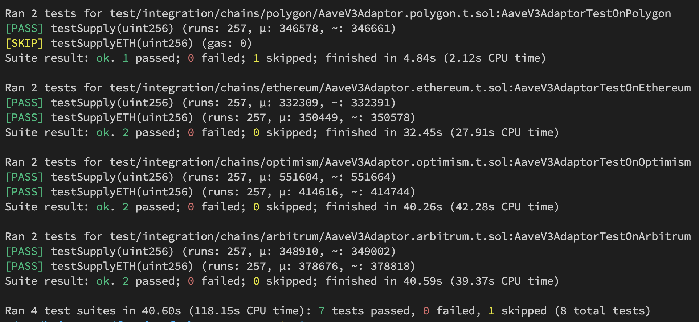

## Foundry-Fork-Test
The Foundry-Fork-Test represents a framework approach used by Foundry for conducting fork chain tests. In response to the demand for multi-chains, it becomes necessary to deploy contracts across different chains. To ensure that contracts work as expected on different chains, tests are usually conducted on a forked chain. This structure ensures that the main test logic does not need to be altered. Instead, modifications are only required on the information of each chain (such as external service address, token address...etc.), enabling tests to be conducted on different chains. Consequently, the speed of the entire development process is enhanced.

## Usage

### 1. Set up [rpc_endpoints] in the `foundry.toml` file ([ref](./foundry.toml))
``` toml
[rpc_endpoints]
polygon = "https://1rpc.io/matic"
arbitrum = "https://1rpc.io/arb"
optimism = "https://1rpc.io/op"
ethereum = "https://1rpc.io/eth"
```

### 2. Create a `baseFork.sol` Contract and Inherit `ForkUtils` ([ref](./test/integration/baseFork.sol))
- Define a `Fork` configuration struct that mainly contains variables whose values depend on the chain, such as external contract addresses or token addresses. Additionally, it can include chain-specific parameters (like liquidation ratio).
- Add the state variable of type `Fork` to store fork-specific configurations.
- Constructor that initializes the contract by passing the chain identifier to the parent `ForkUtils` contract.

```Solidity
// SPDX-License-Identifier: MIT
pragma solidity ^0.8.0;
import {ForkUtils} from "../../src/forkUtils.sol"; // Importing the ForkUtils library from the specified path

// BaseFork contract inheriting from ForkUtils
contract BaseFork is ForkUtils {
    // Define the structure representing the environment-specific configurations for a chain fork
    struct Fork {
        address usdc; // Address of the token on the fork
        address usdt; // Address of the token on the fork
        address aaveV3Provider; // Address of the external service on the fork
        address wrappedNative; // Address of the token on the fork
        // Note: Additional custom variables for different chains can be added, such as liquidation ratios
    }

    // Add the state variable of type Fork to store fork-specific configurations
    Fork public fork;

    // Constructor that initializes the contract by passing the chain identifier to the parent ForkUtils contract
    constructor(
        string memory chain,
        uint256 forkedBlock
    ) ForkUtils(chain, forkedBlock) {}
}
```

### 3. Create a Fork Contract for Each Chain (like `PolygonFork`, `ArbitrumFork`).  ([ref](./test/integration/chains/polygon/polygonFork.sol))
This fork contract should inherit from `BaseFork` and populate the `fork` variable with chain-specific parameters. Additionally, the `BaseFork` constructor should be filled with `chain` and `forkedBlock`. To use the latest block number, simply set `forkedBlock` to `0`.
``` Solidity
// SPDX-License-Identifier: MIT
pragma solidity ^0.8.0;
import {BaseFork} from "../../baseFork.sol";

contract PolygonFork is BaseFork {
    constructor() BaseFork("polygon", 55239312) {
        fork.usdc = 0x2791Bca1f2de4661ED88A30C99A7a9449Aa84174;
        fork.aaveV3Provider = 0xa97684ead0e402dC232d5A977953DF7ECBaB3CDb;
        fork.wrappedNative = 0x0d500B1d8E8eF31E21C99d1Db9A6444d3ADf1270;
    }
}

```


### 4. Writing Test Logic  ([ref](./test/integration/logics/AaveV3Adaptor.t.sol))
- The test contract inherits from `BaseFork` and is designated as an abstract contract.
- Begin writing test logic, initializing all variables related to the chain using `fork.XXX`.
- Each test function must:
    - Be marked as `virtual`.
    - Use the `testSkip` modifier.

```solidity
abstract contract AaveV3AdaptorTest is BaseFork {
    // ...

    function setUp() public {
        // NOTE: Initializes the provider with AaveV3's address provider from the fork setup
        provider = IPoolAddressesProvider(fork.aaveV3Provider);

        // NOTE: Creating an instance of AaveV3Adaptor using wrapped native token and the provider's address from the fork setup
        adapter = new AaveV3Adaptor(fork.wrappedNative, address(provider));

        // NOTE: Getting the USDC token interface from the fork setup
        token = IERC20(fork.usdc);

        // ...
    }

    // NOTE: Ensure this test case is marked to be conditionally skipped using testSkip modifier
    function testSupply(uint256 amount) public virtual testSkip {
        // Write your testing logic here
    }

    // ...
}
```


### 5. Create Specific Test Contracts for Different Chains  ([ref](./test/integration/chains/ethereum/AaveV3Adaptor.ethereum.t.sol))
Implement specific test contracts for each chain by inheriting both the fork contract and the test logic contract, completing the test cases for each chain.

``` solidity
// SPDX-License-Identifier: MIT
pragma solidity ^0.8.0;

import {EthereumFork} from "./ethereumFork.sol";
import {AaveV3AdaptorTest} from "../../logics/AaveV3Adaptor.t.sol";

contract AaveV3AdaptorTestOnEthereum is EthereumFork, AaveV3AdaptorTest {}

```


### All code examples can be referenced in the  [./test/](./test) tests.

---

## Other Features
### Skip Test Cases
To accommodate different tests that may be necessary on different chains, we provide a feature that allows you to skip certain test cases based on the chain. For instance, Aave offers fixed-rate borrowing on the Ethereum chain but not on the Polygon chain. You can skip specific test functions in the test contract's constructor by adding them to the `skipTests` map. This will ignore the specified test functions during test execution.

```Solidity
contract AaveV3AdaptorTestOnPolygon is PolygonFork, AaveV3AdaptorTest {
    constructor() {
        skipTests[AaveV3AdaptorTest.testSupplyETH.selector] = true;
    }
}
```


### Customize Tests
If you want to modify the actions of some test functions in the test logic, you can override the original test function to implement your own testing logic. For example, if you want to use a different token as the test asset, you can override the original test function as follows:

``` Solidity
contract AaveV3AdaptorTestOnOptimism is OptimismFork, AaveV3AdaptorTest {
    function testSupply(uint256 amount) public override {
        // Replace usdc with usdt
        token = IERC20(fork.usdt);
        aToken = IERC20(
            IPool(address(provider.getPool()))
                .getReserveData(address(token))
                .aTokenAddress
        );
        deal(address(token), user, 10 ether);

        // Execute the same test logic but use a different token
        super.testSupply(amount);
    }
}

```


---

## Test
```shell
# Test all test caes
$ forge test -v

# For specific chain
$ forge test --match-path test/integration/chains/polygon/*.t.sol -v
$ forge test --match-path test/integration/chains/optimism/*.t.sol -v

# For specific test file
$ forge test --match-path test/integration/chains/polygon/AaveV3Adaptor.polygon.t.sol -v

# For specific test cases
$ forge test --match-contract AaveV3AdaptorTestOnOptimism --match-test "testSupply" -vvv
```



---

# Contributions

The primary goal is to accelerate the development of smart contracts. Everyone is welcome to fork and submit PRs to further improve the entire framework!
Please see [Contribution Guideline](CONTRIBUTION.md) for more details.
